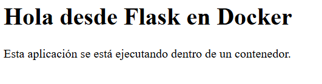

# Parte 4: Aplicación Flask y construcción de la imagen con Dockerfile

[← Volver al índice](README.md)

Este archivo cubre dos secciones del enunciado: la creación de la aplicación sencilla (parte 5 del enunciado) y la construcción de la imagen con un Dockerfile (parte 6 del enunciado).

---

## 1. La aplicación

Código fuente: [`app/app.py`](app/app.py) · Dependencias: [`app/requirements.txt`](app/requirements.txt)

### Qué hace la aplicación

Es un servidor web mínimo escrito en Python con Flask. Responde dos rutas:
**
| Ruta | Respuesta |
|---|---|
| `/` | Una página HTML con un título y un párrafo. El título sale de la variable de entorno `MENSAJE`; si no existe, usa *"Hola desde Flask en Docker"*. |
| `/info` | Un JSON con datos del laboratorio: `{"app": "Laboratorio de contenedores", "curso": "IE0417", "tema": "Docker"}`. Flask convierte automáticamente el diccionario de Python a JSON. |

### Qué dependencia utiliza

Solo **Flask**, declarada en `requirements.txt`. Al instalarla, `pip` también trae las dependencias de Flask (Werkzeug, Jinja2, Click, etc.).

### Prueba local (sin Docker)

```bash
cd app
pip install -r requirements.txt
python app.py
```

Luego abrí `http://localhost:5000` y `http://localhost:5000/info` en el navegador.

```text
 * Serving Flask app 'app'
 * Debug mode: off
WARNING: This is a development server. Do not use it in a production deployment. Use a production WSGI server instead.
 * Running on all addresses (0.0.0.0)
 * Running on http://127.0.0.1:5000
 * Running on http://10.30.7.158:5000
Press CTRL+C to quit
```



### Por qué se usa `host="0.0.0.0"` en lugar de `localhost`

`localhost` (127.0.0.1) es la interfaz de *loopback*: solo acepta conexiones que vienen de la misma máquina. Dentro de un contenedor, "la misma máquina" es el propio contenedor, así que si Flask escuchara en `localhost`, las peticiones que llegan desde mi computadora a través del mapeo de puertos serían rechazadas, porque entran por la interfaz de red del contenedor y no por su loopback.

`0.0.0.0` le dice a Flask que escuche en **todas** las interfaces de red. Así acepta conexiones que llegan desde fuera del contenedor.

### Preguntas de reflexión

**1. ¿Qué hace Flask en esta aplicación?**

Es el framework web. Levanta un servidor HTTP, recibe las peticiones y, según la URL, decide qué función ejecutar (eso hacen los decoradores `@app.route`). Luego convierte lo que la función retorna (texto HTML o un diccionario) en una respuesta HTTP válida.

**2. ¿Para qué sirve el archivo `requirements.txt`?**

Lista las librerías de Python que necesita el proyecto, para poder instalarlas todas con un solo comando (`pip install -r requirements.txt`). Así cualquier persona, o el Dockerfile, puede reproducir el entorno sin adivinar qué hace falta. Una mejora sería fijar la versión (por ejemplo `flask==3.0.3`), para que la imagen no cambie si sale una versión nueva de Flask.

**3. ¿Por qué una aplicación dentro de un contenedor debe escuchar en `0.0.0.0`?**

Porque el contenedor tiene su propia pila de red, y el tráfico que viene del host (por el `-p`) o de otros contenedores llega por su interfaz de red virtual (`eth0`), no por su loopback. Si la app solo escucha en 127.0.0.1, nadie de afuera puede conectarse, aunque los puertos estén publicados.

**4. ¿Qué diferencia hay entre ejecutar la aplicación localmente y ejecutarla dentro de Docker?**

Localmente, la app depende de lo que yo tenga instalado: mi versión de Python, mis paquetes, mi sistema operativo. Si funciona en mi máquina, no hay garantía de que funcione en la de un compañero. Dentro de Docker, la app corre con exactamente la versión de Python y las librerías definidas en la imagen, aislada del resto de mi sistema. El costo es que hay que construir la imagen y publicar puertos para accederla.

---

## 2. El Dockerfile

Archivo: [`app/Dockerfile`](app/Dockerfile)

```dockerfile
FROM python:3.11-slim
WORKDIR /app
COPY requirements.txt .
RUN pip install --no-cache-dir -r requirements.txt
COPY . .
EXPOSE 5000
CMD ["python", "app.py"]
```

Este Dockerfile sigue la misma estructura que el ejemplo visto en clase. Allí se usó una aplicación **Django** con `python:3.10-slim`, el puerto `8000` y `CMD ["python", "manage.py", "runserver", "0.0.0.0:8000"]`; aquí es **Flask** con `python:3.11-slim` y el puerto `5000`. El orden de las instrucciones y la razón detrás de cada una son los mismos.

También sigue el flujo *"De Dockerfile a contenedor"* de la presentación: (1) escribir el Dockerfile, (2) `docker build -t nombre-imagen:tag .`, (3) `docker run nombre-imagen` y (4) gestionar con `ps`, `stop`, `exec` y `logs`.

### Explicación de cada instrucción

| Instrucción | Qué hace |
|---|---|
| `FROM python:3.11-slim` | Define la **imagen base**. Parto de una imagen oficial que ya trae Debian reducido y Python 3.11 instalados, en lugar de empezar de cero. |
| `WORKDIR /app` | Crea la carpeta `/app` dentro de la imagen (si no existe) y la establece como directorio de trabajo para las instrucciones siguientes y para el contenedor final. |
| `COPY requirements.txt .` | Copia el archivo de dependencias desde mi carpeta (el *build context*) hacia `/app` dentro de la imagen. |
| `RUN pip install --no-cache-dir -r requirements.txt` | Ejecuta un comando **durante la construcción**. Instala Flask, y el resultado queda guardado en una capa de la imagen. `--no-cache-dir` evita guardar la caché de pip, lo que reduce el tamaño. |
| `COPY . .` | Copia el resto del proyecto (`app.py`, etc.) a `/app`. |
| `EXPOSE 5000` | **Documenta** que la aplicación escucha en el puerto 5000. No publica el puerto por sí solo; para eso hace falta `-p` al ejecutar. |
| `CMD ["python", "app.py"]` | Define el comando por defecto que se ejecuta **cuando arranca un contenedor**. Uso la forma JSON (*exec form*) para que Python sea el proceso principal (PID 1) y reciba directamente la señal de `docker stop`. |

---

## Comando ejecutado

```bash
cd app
docker build -t laboratorio-flask:1.0 .
```

### Explicación

**Construir una imagen** significa que Docker lee el Dockerfile línea por línea y ejecuta cada instrucción sobre el resultado de la anterior. Cada paso genera una capa, y el conjunto de capas forma la imagen final. El `.` al final es el *build context*: la carpeta cuyos archivos Docker puede usar con `COPY`.

### Resultado obtenido

```text
[+] Building 2.4s (10/10) FINISHED                                                                                                               docker:desktop-linux
 => [internal] load build definition from Dockerfile                                                                                                             0.0s
 => => transferring dockerfile: 200B                                                                                                                             0.0s
 => [internal] load metadata for docker.io/library/python:3.11-slim                                                                                              1.1s
 => [internal] load .dockerignore                                                                                                                                0.0s
 => => transferring context: 2B                                                                                                                                  0.0s
 => [1/5] FROM docker.io/library/python:3.11-slim@sha256:6f31d6e9ba2b0a787a3f81c37b004155b87b9efa1b771182bd550c1615745be5                                        0.1s
 => => resolve docker.io/library/python:3.11-slim@sha256:6f31d6e9ba2b0a787a3f81c37b004155b87b9efa1b771182bd550c1615745be5                                        0.1s
 => [internal] load build context                                                                                                                                0.0s
 => => transferring context: 93B                                                                                                                                 0.0s
 => CACHED [2/5] WORKDIR /app                                                                                                                                    0.0s
 => CACHED [3/5] COPY requirements.txt .                                                                                                                         0.0s
 => CACHED [4/5] RUN pip install --no-cache-dir -r requirements.txt                                                                                              0.0s
 => CACHED [5/5] COPY . .                                                                                                                                        0.0s
 => exporting to image                                                                                                                                           0.9s
 => => exporting layers                                                                                                                                          0.0s
 => => exporting manifest sha256:7a76f736eb4965def9ee312db936bf144e5fd20ae844912620c0be1cffd30cdb                                                                0.1s
 => => exporting config sha256:b2b69de518e11b4efc8c7da563b2a204817cf8b6827d8a9b1f37d05edd312d03                                                                  0.1s
 => => exporting attestation manifest sha256:b5681089962d3798a909d4ac18800140343c13363641010f38391b98988d1c44                                                    0.1s
 => => exporting manifest list sha256:af52160a4333b81ed1eb7d04ec03b4ec71f0c1d1ee9b6d39b7e36441e2e2f181                                                           0.0s
 => => naming to docker.io/library/laboratorio-flask:1.0                                                                                                         0.0s
 => => unpacking to docker.io/library/laboratorio-flask:1.0                                                                                                      0.5s

View build details: docker-desktop://dashboard/build/desktop-linux/desktop-linux/45psr83dghpj1u50c8xb7qysz
```

### Reflexión

La primera construcción tardó porque tuvo que descargar `python:3.11-slim` e instalar Flask. Cuando volví a ejecutar el mismo comando, casi todos los pasos aparecieron como `CACHED` y terminó en un par de segundos. Ahí entendí el sentido de las capas.

---

### Qué significa el nombre `laboratorio-flask:1.0`

Tiene el formato `repositorio:etiqueta`:

- `laboratorio-flask` es el nombre (repositorio) de la imagen.
- `1.0` es la etiqueta (*tag*), normalmente usada para indicar la versión.

Si no pongo etiqueta, Docker usa `latest`. Usar versiones explícitas permite tener varias versiones de la misma imagen y saber exactamente cuál está corriendo.

### Diferencia entre el nombre de la imagen y el nombre del contenedor

- El **nombre de la imagen** (`laboratorio-flask:1.0`) identifica la plantilla. Se define con `docker build -t`.
- El **nombre del contenedor** (`app-lab`) identifica una instancia concreta. Se define con `docker run --name`.

De una sola imagen pueden salir muchos contenedores, cada uno con un nombre distinto. En este laboratorio usé `laboratorio-flask:1.0` para crear `app-lab`, `app-puertos`, `app-logs`, `app-env`, etc.

---

## Comando ejecutado

```bash
docker images
```

### Resultado obtenido

```text
IMAGE                   ID             DISK USAGE   CONTENT SIZE   EXTRA
hello-world:latest      5e2309035332       25.9kB         9.49kB    U   
laboratorio-flask:1.0   af52160a4333        222MB         54.3MB        
ubuntu:latest           f144425ff09b        162MB         45.6MB    U   z
```

### Reflexión

Mi imagen pesa un poco más que `python:3.11-slim`, porque es esa imagen más las capas con Flask y mi código. Esa diferencia de tamaño es lo que realmente agregué yo.

---

## Ejecución, verificación y limpieza

```bash
docker run --name app-lab laboratorio-flask:1.0
# en otra terminal:
docker ps
docker stop app-lab
docker rm app-lab
```

### Resultado obtenido

```text
- docker run --name app-lab laboratorio-flask:1.0
 * Serving Flask app 'app'
 * Debug mode: off
WARNING: This is a development server. Do not use it in a production deployment. Use a production WSGI server instead.
 * Running on all addresses (0.0.0.0)
 * Running on http://127.0.0.1:5000
 * Running on http://172.17.0.2:5000
Press CTRL+C to quit
- docker ps
CONTAINER ID   IMAGE                   COMMAND           CREATED              STATUS              PORTS      NAMES
e766769b6a37   laboratorio-flask:1.0   "python app.py"   About a minute ago   Up About a minute   5000/tcp   app-lab
```

### Reflexión

El contenedor arrancó y Flask quedó escuchando, pero en la columna `PORTS` de `docker ps` aparece `5000/tcp` **sin** una flecha `->`. Eso significa que el puerto está expuesto (por el `EXPOSE`), pero no publicado hacia el host. Por eso `http://localhost:5000` no responde todavía, y eso es justamente lo que se resuelve en la parte de puertos. También noté que la terminal quedó "ocupada" mostrando los logs, porque no usé `-d`.

---

## Preguntas de reflexión

**1. ¿Qué es una imagen base?**

Es la imagen de la que parte mi Dockerfile (la del `FROM`). Aporta lo que no quiero construir yo: el sistema de archivos de una distribución y, en este caso, Python ya instalado. Mi imagen se construye agregando capas encima de ella.

**2. ¿Por qué se usa una imagen `slim`?**

Porque es una variante reducida: trae Debian con solo los paquetes mínimos para que Python funcione, sin compiladores ni herramientas extra. Pesa alrededor de 130 MB frente a casi 1 GB de la imagen `python:3.11` completa. Eso hace que se descargue y despliegue más rápido, ocupe menos disco y tenga menos software con posibles vulnerabilidades. La desventaja es que, si una librería necesita compilarse, puede faltar algo y hay que instalarlo a mano.

**3. ¿Por qué se copian primero las dependencias y luego el resto del código?**

Por la caché de capas. Docker reutiliza una capa si la instrucción y los archivos que usa no cambiaron. El código (`app.py`) cambia muy seguido; `requirements.txt` casi nunca. Si copio primero solo `requirements.txt` y luego hago el `pip install`, al modificar `app.py` solo se invalida el último `COPY . .`, y la instalación de dependencias sale de la caché. Si copiara todo al principio, cada cambio en el código obligaría a reinstalar Flask.

**4. ¿Qué diferencia hay entre `RUN` y `CMD`?**

`RUN` se ejecuta **una vez, al construir la imagen**, y su resultado queda guardado en una capa (por ejemplo, Flask instalado). `CMD` **no se ejecuta al construir**: solo deja registrado qué comando correr **cada vez que se inicia un contenedor**. Además, solo cuenta el último `CMD` del Dockerfile, y se puede reemplazar al hacer `docker run imagen otro-comando`.

**5. ¿Qué pasaría si se elimina la imagen pero no el Dockerfile?**

No se pierde nada importante: con el Dockerfile, el código y `docker build` puedo reconstruir la imagen cuando quiera (tardaría un poco más porque no habría caché). El Dockerfile es la "receta" y la imagen es el resultado. Lo que sí pasaría es que no podría crear contenedores nuevos de esa imagen hasta reconstruirla. Además, Docker no deja borrar una imagen que esté siendo usada por un contenedor existente, salvo forzándolo.
