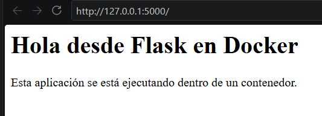
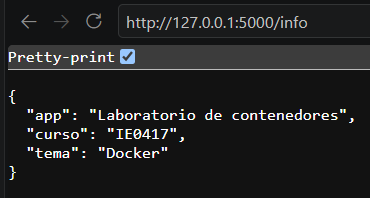
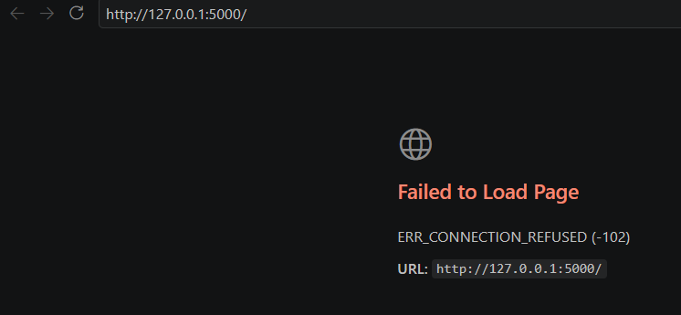
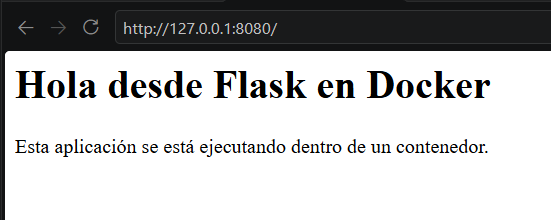
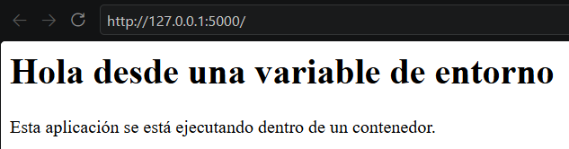
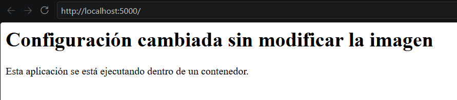

# Parte 5: Publicación de puertos, logs y variables de entorno

[← Volver al índice](README.md)

Este archivo cubre tres secciones del enunciado: publicación de puertos (parte 7), logs e inspección (parte 8) y variables de entorno (parte 9).

---

## Publicación de puertos

### Comandos ejecutados

```bash
docker run --name app-puertos -p 5000:5000 laboratorio-flask:1.0
# navegador: http://localhost:5000  y  http://localhost:5000/info
docker stop app-puertos
docker rm app-puertos

docker run --name app-puertos-2 -p 8080:5000 laboratorio-flask:1.0
# navegador: http://localhost:8080
docker stop app-puertos-2
docker rm app-puertos-2
```

### Explicación

La opción `-p PUERTO_HOST:PUERTO_CONTENEDOR` crea una regla de reenvío: todo lo que llegue al puerto del host se redirige al puerto indicado dentro del contenedor. El orden siempre es **host primero, contenedor después**.

| Opción | Puerto del host | Puerto del contenedor | URL en el navegador |
|---|---|---|---|
| `-p 5000:5000` | 5000 | 5000 | `http://localhost:5000` |
| `-p 8080:5000` | 8080 | 5000 | `http://localhost:8080` |

- **`-p 5000:5000`**: el puerto 5000 de mi computadora se conecta al puerto 5000 del contenedor, que es donde escucha Flask.
- **`-p 8080:5000`**: el puerto 8080 de mi computadora se conecta al mismo puerto 5000 del contenedor. La aplicación no cambió nada; solo cambió por dónde entro desde afuera.

El puerto del **contenedor** (5000) lo define la aplicación (`app.run(port=5000)`). El puerto del **host** lo elijo yo al ejecutar `docker run`.

### Resultado obtenido

```text
docker run --name app-puertos -p 5000:5000 laboratorio-flask:1.0
 * Serving Flask app 'app'
 * Debug mode: off
WARNING: This is a development server. Do not use it in a production deployment. Use a production WSGI server instead.
 * Running on all addresses (0.0.0.0)
 * Running on http://127.0.0.1:5000
 * Running on http://172.17.0.2:5000
Press CTRL+C to quit
172.17.0.1 - - [05/Oct/2026 06:28:52] "GET / HTTP/1.1" 200 -
172.17.0.1 - - [05/Oct/2026 06:30:00] "GET /info HTTP/1.1" 200 -
172.17.0.1 - - [05/Oct/2026 06:30:41] "GET /info HTTP/1.1" 200 -
172.17.0.1 - - [05/Oct/2026 06:30:48] "GET / HTTP/1.1" 200 -
```




```text
docker stop app-puertos
app-puertos
docker rm app-puertos
app-puertos
```



```text
 docker run --name app-puertos-2 -p 8080:5000 laboratorio-flask:1.0

 * Serving Flask app 'app'
 * Debug mode: off
WARNING: This is a development server. Do not use it in a production deployment. Use a production WSGI server instead.
 * Running on all addresses (0.0.0.0)
 * Running on http://127.0.0.1:5000
 * Running on http://172.17.0.2:5000
Press CTRL+C to quit
172.17.0.1 - - [05/Oct/2026 06:36:02] "GET / HTTP/1.1" 200 -
172.17.0.1 - - [05/Oct/2026 06:36:02] "GET /favicon.ico HTTP/1.1" 404 -
```


```text
docker stop app-puertos-2
app-puertos-2
docker rm app-puertos-2
app-puertos-2
```


### Reflexión

Fue la primera vez que vi la app en el navegador corriendo desde Docker. Lo que más me ayudó a entender el mapeo fue el caso `8080:5000`: dentro del contenedor nada cambió, Flask sigue en el 5000; solo cambió la "puerta de entrada" del lado de mi máquina.

### Preguntas de reflexión

**1. ¿Por qué no basta con que la aplicación escuche en el puerto 5000 dentro del contenedor?**

Porque el contenedor tiene su propia red aislada. Su puerto 5000 existe en esa red virtual, no en la de mi computadora. Sin `-p`, cuando abro `localhost:5000` en mi navegador, nada en el host escucha en ese puerto y la conexión se rechaza. Esto lo comprobé con el contenedor `app-lab` de la parte anterior.

**2. ¿Qué función cumple el mapeo de puertos?**

Conecta la red del host con la red del contenedor. Docker configura una regla de reenvío (con iptables o un proxy interno) para que el tráfico que llega a un puerto del host termine en el puerto del contenedor. Es lo que permite que un servicio aislado sea accesible desde afuera, y de forma controlada: solo los puertos que yo publique.

**3. ¿Cuál es la diferencia entre el puerto del host y el puerto del contenedor?**

El del contenedor es donde la aplicación realmente escucha, y lo decide la aplicación. El del host es el puerto por el que se accede desde mi máquina o desde la red, y lo decido yo al ejecutar el contenedor. Pueden ser iguales o distintos. Esa flexibilidad permite, por ejemplo, correr varias copias de la misma imagen en puertos distintos del host.

**4. ¿Qué pasaría si dos contenedores intentan usar el mismo puerto del host?**

El segundo `docker run` falla con un error del tipo *"Bind for 0.0.0.0:5000 failed: port is already allocated"*. Un puerto del host solo puede tener un dueño a la vez. En cambio, ambos contenedores sí pueden usar el puerto 5000 **internamente**, porque cada uno tiene su propia red; solo hay que mapearlos a puertos distintos del host (por ejemplo `-p 5000:5000` y `-p 5001:5000`).

---

## Logs e inspección

### Comandos ejecutados

```bash
docker run -d --name app-logs -p 5000:5000 laboratorio-flask:1.0
docker logs app-logs
docker logs -f app-logs
# en el navegador: http://localhost:5000 y http://localhost:5000/info
docker inspect app-logs
docker stats
docker stop app-logs
docker rm app-logs
```

### Explicación de `-d`

`-d` (*detached*) ejecuta el contenedor en segundo plano. La terminal queda libre y Docker solo imprime el ID del contenedor. Por eso aquí necesité `docker logs` para ver lo que imprime la app.

### Qué muestra `docker logs`

Muestra todo lo que el proceso principal del contenedor ha escrito en la salida estándar y la salida de error desde que arrancó. En este caso, el mensaje de inicio de Flask y una línea por cada petición HTTP (IP, fecha, método, ruta y código de respuesta).

```text
* Serving Flask app 'app'
 * Debug mode: off
WARNING: This is a development server. Do not use it in a production deployment. Use a production WSGI server instead.
 * Running on all addresses (0.0.0.0)
 * Running on http://127.0.0.1:5000
 * Running on http://172.17.0.2:5000
Press CTRL+C to quit
```

### Para qué sirve `docker logs -f`

`-f` (*follow*) se queda "pegado" mostrando las líneas nuevas en tiempo real, como `tail -f`. Mientras estaba activo, cada vez que recargaba la página en el navegador aparecía una línea nueva en la terminal. Se sale con `Ctrl+C`, y eso **no** detiene el contenedor, solo deja de seguir los logs.

```text
 * Serving Flask app 'app'
 * Debug mode: off
WARNING: This is a development server. Do not use it in a production deployment. Use a production WSGI server instead.
 * Running on all addresses (0.0.0.0)
 * Running on http://127.0.0.1:5000
 * Running on http://172.17.0.2:5000
Press CTRL+C to quit
172.17.0.1 - - [05/Oct/2026 07:08:30] "GET / HTTP/1.1" 200 -
172.17.0.1 - - [05/Oct/2026 07:08:30] "GET /favicon.ico HTTP/1.1" 404 -
172.17.0.1 - - [05/Oct/2026 07:08:35] "GET /info HTTP/1.1" 200 -

```

### Qué tipo de información muestra `docker inspect`

Devuelve un JSON grande con **toda** la configuración y el estado del contenedor. Lo más útil que encontré:

- `State`: si está corriendo, el PID, la hora de inicio y el código de salida.
- `Config.Image`, `Config.Cmd`, `Config.Env`: imagen usada, comando y variables de entorno (aquí aparece `PATH`, `PYTHON_VERSION`, etc.).
- `HostConfig.PortBindings` y `NetworkSettings.Ports`: el mapeo `5000/tcp -> 0.0.0.0:5000`.
- `NetworkSettings.Networks`: red a la que está conectado (`bridge`), IP interna y gateway.
- `Mounts`: volúmenes o bind mounts (vacío en este caso).

```text
        "State": {
            "Status": "running",
            "Running": true,
            "Paused": false,
            "Restarting": false,
            "OOMKilled": false,
            "Dead": false,
            "Pid": 380,
            "ExitCode": 0,
            "Error": "",
            "StartedAt": "2026-10-05T07:06:24.3526857Z",
            "FinishedAt": "0001-01-01T00:00:00Z"
        },
        "Ports": {
            "5000/tcp": [
                {
                    "HostIp": "0.0.0.0",
                    "HostPort": "5000"
                },
                {
                    "HostIp": "::",
                    "HostPort": "5000"
                }
            ]
        },
```

### Qué información muestra `docker stats`

Una tabla que se actualiza en vivo con el consumo de cada contenedor en ejecución: porcentaje de CPU, memoria usada contra el límite (`MEM USAGE / LIMIT`), porcentaje de memoria, tráfico de red (`NET I/O`), lectura y escritura de disco (`BLOCK I/O`) y número de procesos (`PIDS`). Se sale con `Ctrl+C`.

```text
CONTAINER ID   NAME       CPU %     MEM USAGE / LIMIT     MEM %     NET I/O           BLOCK I/O        PIDS
69aa0d134ebb   app-logs   0.03%     22.41MiB / 7.678GiB   0.29%     4.62kB / 2.21kB   28.2MB / 147kB   1
```

### Reflexión

La app de Flask casi no consume nada (alrededor de 20 a 30 MB de RAM y CPU cerca de 0 % en reposo). Me sorprendió compararlo con lo que pesaría una máquina virtual solo para esto.

### Preguntas de reflexión

**1. ¿Por qué los logs son importantes al trabajar con contenedores?**

Porque normalmente los contenedores corren en segundo plano y no tienen una pantalla donde ver errores. Los logs son la forma principal de saber qué está pasando adentro: si la app arrancó, qué peticiones recibe y, sobre todo, por qué falló. Si un contenedor se cae apenas inicia, `docker logs` casi siempre muestra el error.

**2. ¿Qué diferencia hay entre ver logs históricos y logs en tiempo real?**

`docker logs` muestra lo que ya pasó, hasta el momento en que ejecuto el comando, y termina. Sirve para investigar algo que ocurrió antes. `docker logs -f` sigue mostrando lo nuevo conforme ocurre, y sirve para observar el comportamiento mientras pruebo algo, como cuando recargaba la página. También existen opciones como `--tail 20` para ver solo las últimas líneas o `--since 5m` para filtrar por tiempo.

**3. ¿Qué información útil se puede obtener con `docker inspect`?**

La IP interna del contenedor, los puertos publicados, las variables de entorno, los volúmenes montados, la red a la que pertenece, el comando que ejecuta, la imagen de origen y su estado (incluido el código de salida si se detuvo). Es útil para depurar: por ejemplo, para confirmar que una variable `-e` sí llegó o que un volumen se montó en la ruta correcta.

**4. ¿Por qué es importante observar el consumo de recursos?**

Porque todos los contenedores comparten la CPU y la memoria del mismo host. Un contenedor con una fuga de memoria o un ciclo infinito puede afectar a los demás. Observar el consumo ayuda a detectar esos problemas, a definir límites razonables (`--memory`, `--cpus`) y a estimar cuántos servicios caben en un servidor.

---

## Variables de entorno

### Comandos ejecutados

```bash
docker run --name app-env -p 5000:5000 -e MENSAJE="Hola desde una variable de entorno" laboratorio-flask:1.0
# navegador: http://localhost:5000
docker stop app-env
docker rm app-env

docker run --name app-env-2 -p 5000:5000 -e MENSAJE="Configuración cambiada sin modificar la imagen" laboratorio-flask:1.0
# navegador: http://localhost:5000
docker stop app-env-2
docker rm app-env-2
```

### Qué hace la opción `-e`

`-e NOMBRE=valor` define una variable de entorno dentro del contenedor al momento de crearlo. El proceso de la aplicación la ve igual que cualquier variable de entorno del sistema. En `app.py`, la línea `os.environ.get("MENSAJE", "Hola desde Flask en Docker")` la lee y, si no existe, usa el texto por defecto.

### Qué cambió en la aplicación

Solo cambió el título (`<h1>`) de la página principal:

| Ejecución | Título mostrado |
|---|---|
| Sin `-e` (partes anteriores) | Hola desde Flask en Docker |
| `app-env` | Hola desde una variable de entorno |
| `app-env-2` | Configuración cambiada sin modificar la imagen |

El párrafo y la ruta `/info` siguieron igual, porque no dependen de la variable.


```text
docker run --name app-env -p 5000:5000 -e MENSAJE="Hola desde una variable de entorno" laboratorio-flask:1.0
 * Serving Flask app 'app'
 * Debug mode: off
WARNING: This is a development server. Do not use it in a production deployment. Use a production WSGI server instead.
 * Running on all addresses (0.0.0.0)
 * Running on http://127.0.0.1:5000
 * Running on http://172.17.0.2:5000
Press CTRL+C to quit
172.17.0.1 - - [05/Oct/2026 07:20:12] "GET / HTTP/1.1" 200 -
```


```text
 docker run --name app-env-2 -p 5000:5000 -e MENSAJE="Configuración cambiada sin modificar la imagen" laboratorio-flask:1.0
 * Serving Flask app 'app'
 * Debug mode: off
WARNING: This is a development server. Do not use it in a production deployment. Use a production WSGI server instead.
 * Running on all addresses (0.0.0.0)
 * Running on http://127.0.0.1:5000
 * Running on http://172.17.0.2:5000
Press CTRL+C to quit
172.17.0.1 - - [05/Oct/2026 07:32:50] "GET / HTTP/1.1" 200 -
```



### Por qué no fue necesario reconstruir la imagen

Porque el mensaje no está "quemado" en la imagen. La imagen contiene el código que **lee** la variable, y el valor se entrega al crear cada contenedor. Las variables de entorno forman parte de la configuración del contenedor, no de la imagen. Por eso la misma `laboratorio-flask:1.0` produjo dos comportamientos distintos sin ejecutar `docker build`.

### Preguntas de reflexión

**1. ¿Por qué es útil configurar aplicaciones mediante variables de entorno?**

Porque separa el código de la configuración. La misma imagen puede usarse en desarrollo, pruebas y producción cambiando solo los valores al ejecutarla. No hay que editar código, recompilar ni mantener una imagen distinta por ambiente. Además, es un mecanismo estándar que entienden casi todos los lenguajes y plataformas.

**2. ¿Qué tipo de información podría configurarse así?**

Direcciones y puertos de otros servicios (por ejemplo `DB_HOST=redis-lab`), nombres de bases de datos, nivel de logs (`LOG_LEVEL=debug`), el ambiente (`ENV=produccion`), activar o desactivar funcionalidades, URLs de APIs externas, zona horaria y, con cuidado, credenciales o claves de API.

**3. ¿Por qué no es buena práctica guardar contraseñas directamente dentro del código?**

Porque el código se sube a repositorios, se comparte y queda en el historial de Git **para siempre**, aunque luego se borre la línea. Cualquiera con acceso al repo o a la imagen podría verla. Además, cambiar la contraseña obligaría a modificar el código y reconstruir. Cabe aclarar que las variables de entorno tampoco son totalmente secretas (`docker inspect` las muestra), por eso en producción se usan mecanismos como Docker secrets o gestores de secretos.

**4. ¿Qué ventaja tiene usar la misma imagen con diferentes configuraciones?**

Garantiza que lo que se probó es exactamente lo que se despliega: el código y las dependencias son idénticos y solo cambia la configuración. Eso reduce el clásico "en mi máquina sí funcionaba". También ahorra espacio y tiempo, porque se construye y se guarda una sola imagen en lugar de una por ambiente.
