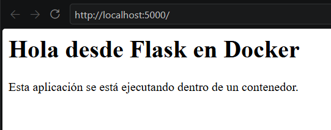
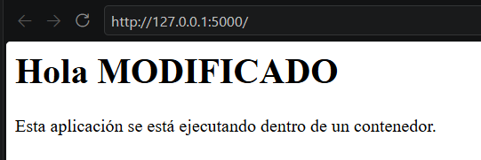

# Parte 6: Persistencia con volúmenes y bind mounts

[← Volver al índice](README.md)

Este archivo cubre dos secciones del enunciado: persistencia con volúmenes (parte 10) y bind mounts (parte 11).

---

## Volúmenes

### Qué es un volumen

Un volumen es un espacio de almacenamiento que **administra Docker** y que existe de forma independiente a cualquier contenedor. Se monta dentro de un contenedor en una ruta (por ejemplo `/datos`), y todo lo que el contenedor escribe ahí se guarda en el volumen en vez de en la capa de escritura del contenedor. Por eso los datos sobreviven aunque el contenedor se elimine.

Como se explicó en clase, por defecto los datos dentro de un contenedor se pierden al eliminarlo, y los volúmenes, gestionados por Docker, permiten la persistencia fuera del contenedor. Los ejemplos de la presentación (`docker volume create datos`, `-v datos:/app` y `-v $(pwd):/app`) son los mismos dos tipos de montaje que se prueban en esta parte: un volumen con nombre y un bind mount.

### Comandos ejecutados

```bash
docker volume create datos-lab
docker volume ls

docker run -it --name contenedor-volumen -v datos-lab:/datos ubuntu bash
# dentro del contenedor:
echo "Este archivo está en un volumen" > /datos/archivo.txt
cat /datos/archivo.txt
exit

docker rm contenedor-volumen

docker run -it --name contenedor-volumen-2 -v datos-lab:/datos ubuntu bash
# dentro del nuevo contenedor:
cat /datos/archivo.txt
exit

docker rm contenedor-volumen-2
docker volume inspect datos-lab
```

### Cómo se crea

Con `docker volume create datos-lab`. Después, `docker volume ls` lo muestra en la lista con el driver `local`. Si se usa `-v nombre:/ruta` con un volumen que no existe, Docker también lo crea automáticamente, pero crearlo de forma explícita deja más claro qué se está haciendo.

```text
docker volume create datos-lab
datos-lab
docker volume ls
DRIVER    VOLUME NAME
local     datos-lab
```

### Cómo se monta en un contenedor

Con la opción `-v NOMBRE_VOLUMEN:RUTA_EN_CONTENEDOR`, en este caso `-v datos-lab:/datos`. Docker hace que la carpeta `/datos` dentro del contenedor apunte al volumen. Una forma equivalente y más explícita es:

```bash
--mount type=volume,source=datos-lab,target=/datos
```

### Qué pasó con el archivo después de eliminar el primer contenedor

**El archivo siguió existiendo.** Eliminé `contenedor-volumen` con `docker rm` y luego creé `contenedor-volumen-2`, un contenedor totalmente nuevo. Al hacer `cat /datos/archivo.txt` apareció *"Este archivo está en un volumen"*.

Esto es lo opuesto a lo que pasó con `mensaje.txt` en la parte 3, que se perdió al borrar `mi-ubuntu`. La diferencia es que `mensaje.txt` estaba en la capa del contenedor, y `archivo.txt` está en el volumen.

```text
cat /datos/archivo.txt
Este archivo está en un volumen
cat /datos/archivo.txt
Este archivo está en un volumen
```

### Resultado de `docker volume inspect`

```text
docker volume inspect datos-lab
[
    {
        "CreatedAt": "2026-10-05T07:47:10Z",
        "Driver": "local",
        "Labels": null,
        "Mountpoint": "/var/lib/docker/volumes/datos-lab/_data",
        "Name": "datos-lab",
        "Options": null,
        "Scope": "local"
    }
]
```

La salida es un JSON con:

- `Name`: `datos-lab`.
- `Driver`: `local`, es decir, se guarda en el disco del host.
- `Mountpoint`: la ruta real donde Docker guarda el volumen, `/var/lib/docker/volumes/datos-lab/_data`. Ahí físicamente está `archivo.txt`. Como uso Docker Desktop en Windows, esa ruta está dentro de la máquina virtual de Docker y no directamente en mi disco de Windows.
- `CreatedAt`, `Labels`, `Scope`.

Llama la atención que el JSON **no menciona ningún contenedor**: el volumen no sabe ni le importa quién lo usa.

### Reflexión

Esta parte me aclaró algo que en la parte 3 parecía un problema: los contenedores son desechables, pero eso no implica perder datos si se separan correctamente. El contenedor es el "programa" y el volumen es el "disco de datos".

### Preguntas de reflexión

**1. ¿Qué problema resuelven los volúmenes?**

La pérdida de datos al eliminar un contenedor. Como los contenedores se borran y se recrean constantemente (por actualizaciones o fallos), los datos importantes no pueden vivir dentro de ellos. Los volúmenes guardan esos datos fuera del ciclo de vida del contenedor. Además, permiten compartir datos entre varios contenedores y suelen tener mejor rendimiento de escritura que la capa del contenedor.

**2. ¿El volumen pertenece a un contenedor específico?**

No. Es un objeto independiente de Docker. Lo demostré al montar el mismo volumen primero en `contenedor-volumen` y luego en `contenedor-volumen-2`. Incluso podría montarse en varios contenedores al mismo tiempo. Su ciclo de vida se administra por separado con `docker volume ...`.

**3. ¿Qué diferencia hay entre eliminar un contenedor y eliminar un volumen?**

`docker rm` elimina el contenedor y su capa de escritura, pero **no** toca los volúmenes que tenía montados. `docker volume rm datos-lab` elimina el volumen y **todos los datos que contiene**, sin posibilidad de recuperarlos. Por eso Docker no deja borrar un volumen que está en uso por un contenedor. Borrar un contenedor es una operación rutinaria; borrar un volumen hay que pensarlo dos veces.

**4. ¿Para qué casos reales se usarían volúmenes?**

- Archivos de bases de datos (PostgreSQL en `/var/lib/postgresql/data`, MySQL, MongoDB, Redis con persistencia).
- Archivos que suben los usuarios a una aplicación web.
- Logs que se quieren conservar o analizar después.
- Caché de dependencias o resultados entre ejecuciones.
- Compartir datos entre contenedores, por ejemplo uno que genera archivos y otro que los sirve.

---

## Bind mounts

### Comandos ejecutados

Trabajé en Windows con PowerShell, así que usé la sintaxis de la nota para Windows del enunciado: `${PWD}` en lugar de `"$(pwd)"`.

```powershell
cd app
docker run --name app-bind -p 5000:5000 -v ${PWD}:/app laboratorio-flask:1.0
# navegador: http://localhost:5000
# luego modifiqué app.py en mi máquina (ver abajo)
docker stop app-bind
docker rm app-bind

docker run --name app-bind-2 -p 5000:5000 -v ${PWD}:/app laboratorio-flask:1.0
# navegador: http://localhost:5000
docker stop app-bind-2
docker rm app-bind-2
```

### Resultado obtenido

Antes de modificar `app.py` (`app-bind`):



Después de modificar `app.py` y recrear el contenedor (`app-bind-2`):



### Diferencia entre `datos-lab:/datos` y `${PWD}:/app`

Docker distingue el tipo de montaje por lo que va antes de los dos puntos. El enunciado lo escribe como `"$(pwd)":/app` (Bash); en PowerShell es `${PWD}:/app`, y ambos significan lo mismo.

| | `datos-lab:/datos` | `${PWD}:/app` |
|---|---|---|
| Tipo | **Volumen** (un nombre) | **Bind mount** (una ruta del host) |
| Quién lo administra | Docker, en su propia carpeta interna | Yo: es una carpeta normal de mi computadora |
| Ubicación real | `/var/lib/docker/volumes/datos-lab/_data` | La carpeta actual (`app/` de mi proyecto) |
| Contenido inicial | Vacío, o lo que traiga la imagen en esa ruta | Lo que haya en mi carpeta, que **reemplaza** lo que la imagen tenía en `/app` |
| Se ve con `docker volume ls` | Sí | No |

`${PWD}` es una variable de PowerShell que contiene la ruta absoluta de la carpeta en la que estoy; en mi caso, `C:\Users\...\Lab03_C33910_Contenedores\app`. Por eso el comando debe ejecutarse **desde la carpeta `app`**. Si se ejecuta desde la carpeta principal del laboratorio, se monta esa carpeta en `/app` y el contenedor falla con `can't open file '/app/app.py'`, porque ahí no está el archivo.

### Qué ocurrió al modificar el código local

Al recrear el contenedor (`app-bind-2`) **sin reconstruir la imagen**, la página mostró el texto nuevo. La imagen `laboratorio-flask:1.0` sigue teniendo el `app.py` original, pero el bind mount "tapa" la carpeta `/app` de la imagen con mi carpeta local. Así, el contenedor ejecuta el código que tengo en mi editor en ese momento.

Hubo que recrear el contenedor para ver el cambio porque, aunque el archivo dentro del contenedor cambia al mismo tiempo que en mi computadora (es el mismo archivo), Flask carga el código en memoria al arrancar. Si Flask estuviera en modo debug, con recarga automática, el cambio se vería sin reiniciar.

### Por qué esto puede ser útil durante el desarrollo

Porque elimina el ciclo "editar → `docker build` → `docker run`" en cada cambio pequeño. Edito con mi editor normal, en mi máquina, y el contenedor ve los cambios al instante (y con recarga automática ni siquiera hay que reiniciarlo). Mientras tanto, la app sigue corriendo con el Python y las dependencias de la imagen, no con lo que tenga instalado en mi computadora.

### Preguntas de reflexión

**1. ¿Qué diferencia hay entre un volumen y un bind mount?**

Un volumen es almacenamiento creado y administrado por Docker, identificado por un nombre y guardado en una ubicación que no debería tocar directamente. Un bind mount conecta una carpeta específica de mi computadora (por ruta) dentro del contenedor: los cambios se ven en ambos lados al instante, porque es literalmente la misma carpeta. El volumen es portable (funciona igual en cualquier host); el bind mount depende de la estructura de carpetas de mi máquina.

**2. ¿Cuál parece más conveniente para desarrollo?**

El **bind mount**, porque permite editar el código en el host y verlo reflejado en el contenedor sin reconstruir la imagen, como hice en esta parte.

**3. ¿Cuál parece más conveniente para datos persistentes de una aplicación?**

El **volumen**. Docker lo administra, no depende de rutas ni permisos de mi máquina, tiene mejor rendimiento (sobre todo en Docker Desktop, donde los bind mounts cruzan de Windows a la máquina virtual de Docker) y se puede respaldar o mover con las herramientas de Docker. Además, es más difícil que alguien borre o modifique los datos por accidente desde el host.

**4. ¿Qué riesgos podría tener montar carpetas del host dentro del contenedor?**

- **Seguridad:** el contenedor puede leer y modificar archivos reales del host. Si monto algo sensible (mi carpeta personal, `/etc` o el socket de Docker), un contenedor comprometido podría robar información o tomar control del sistema. Como el proceso suele correr como `root` dentro del contenedor, podría crear archivos que luego mi usuario no puede borrar.
- **Borrado accidental:** si la app dentro del contenedor borra archivos, se borran de mi disco.
- **Ocultamiento de archivos:** el bind mount reemplaza lo que la imagen tenía en esa ruta. Si en mi carpeta falta algún archivo que la imagen sí tenía, la app puede fallar. Esto pasa, por ejemplo, si se ejecuta el comando desde una carpeta equivocada.
- **Portabilidad:** el comando depende de rutas que solo existen en mi máquina, e incluso de la terminal (`${PWD}` en PowerShell y `"$(pwd)"` en Bash).

Para reducir el riesgo se puede montar en solo lectura (`-v ${PWD}:/app:ro`) y montar únicamente la carpeta necesaria.